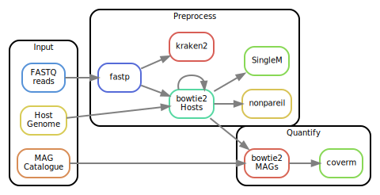

# Snakemake workflow: `mg_quant`

[](https://snakemake.github.io)
[](https://github.com/3d-omics/mg_quant/actions)


A Snakemake workflow for assessing detection limit from laser-microdissected samples.

## Usage

0. Requirements
   1.  [`miniconda`](https://docs.conda.io/en/latest/miniconda.html) / [`mamba`](https://mamba.readthedocs.io)
   2.  [`snakemake`](snakemake.readthedocs.io/)
   3.  (Optional) [An executor plugin if you are in an HPC environment](https://snakemake.github.io/snakemake-plugin-catalog/)

1. Clone the repository
Clone the repository, and set it as the working directory.

```
git clone --recursive https://github.com/3d-omics/mg_quant.git
cd mg_quant
```

2. Run the pipeline with the test data (takes 5 minutes to download the required software)
```
snakemake \
    --use-conda \
    --conda-frontend mamba \
    --jobs 8
```

3. Edit the following files:
   1. `config/samples.tsv`: the control file with the sequencing libraries and their location.
      ```
      sample_id	library_id	forward_filename	reverse_filename	forward_adapter	reverse_adapter
      sample1	lib1	resources/reads/sample1_1.fq.gz	resources/reads/sample1_2.fq.gz	AGATCGGAAGAGCACACGTCTGAACTCCAGTCA	AGATCGGAAGAGCGTCGTGTAGGGAAAGAGTGT
      sample2	lib1	resources/reads/sample2_1.fq.gz	resources/reads/sample2_2.fq.gz	AGATCGGAAGAGCACACGTCTGAACTCCAGTCA	AGATCGGAAGAGCGTCGTGTAGGGAAAGAGTGT
      ```
   2. `config/features.yml`: the references and databases against which to screen the libraries: hosts and MAG catalogues.
      ```
      references:  # Reads will be mapped sequentially
         human: resources/reference/human_22_sub.fa.gz
         chicken: resources/reference/chicken_39_sub.fa.gz

      mag_catalogues:
         mag1: resources/reference/mags_sub.fa.gz
         # mag2: resources/reference/mags_sub.fa.gz

      databases:
         kraken2:
            mock1: resources/databases/kraken2/kraken2_RefSeqV205_Complete_500GB
            # refseq500: resources/databases/kraken2/kraken2_RefSeqV205_Complete_500GB
         singlem: resources/databases/singlem/S3.2.1.GTDB_r214.metapackage_20231006.smpkg.zb
      ```

   3. `config/params.yml`: parameters for every program. The defaults are reasonable.


4. Run the pipeline and go for a walk:

```
snakemake --use-conda --profile profile/default --jobs 100 --cores 24 `#--executor slurm`
```

## Rulegraph



## Brief description

1. Trim reads and remove adaptors with `fastp`
2. Map to human, chicken / pig, mag catalogue:
   1. Map to the reference with `bowtie2`
   2. Extract the reads that have one of both ends unmapped with `samtools`
   3. Map those unmapped reads to the next reference
3. Generate MAG-based statistics with  `coverm`
4. Generate MAG-independent statistics with `singlem` and `nonpareil`
5. Assign taxonomically reads with `kraken2`
6. Generate lots of reports in the `reports/` folder


## References

- [fastp](https://github.com/OpenGene/fastp)
- [bowtie2](https://bowtie-bio.sourceforge.net/bowtie2/manual.shtml)
- [samtools](https://www.htslib.org/)
- [coverm](https://github.com/wwood/CoverM)
- [singlem](https://github.com/wwood/singlem)
- [nonpareil](http://enve-omics.ce.gatech.edu/nonpareil/)
- [fastqc](https://github.com/s-andrews/FastQC)
- [multiqc](https://multiqc.info/)
- [kraken2](https://github.com/DerrickWood/kraken2)


## Caveats

### kraken2

kraken2 has a performance flaw: it cannot process a batch of samples while loading the database once. As a workaround, we copy the database to `/dev/shm` (so it works at RAM speed), process in parallel each sample using a single CPU, and delete the database. In case of failure or canceling while it is running, it is possible that the database in `/dev/shm` is still there in a worker node. In that case you have to go there and delete it.

### SingleM

SingleM is very disk intensive, and if the database is in a computer cluster, probably extremely network intensive too. I've seen a cluster starting to slow down with 4-8 jobs working in parallel. Be careful.
